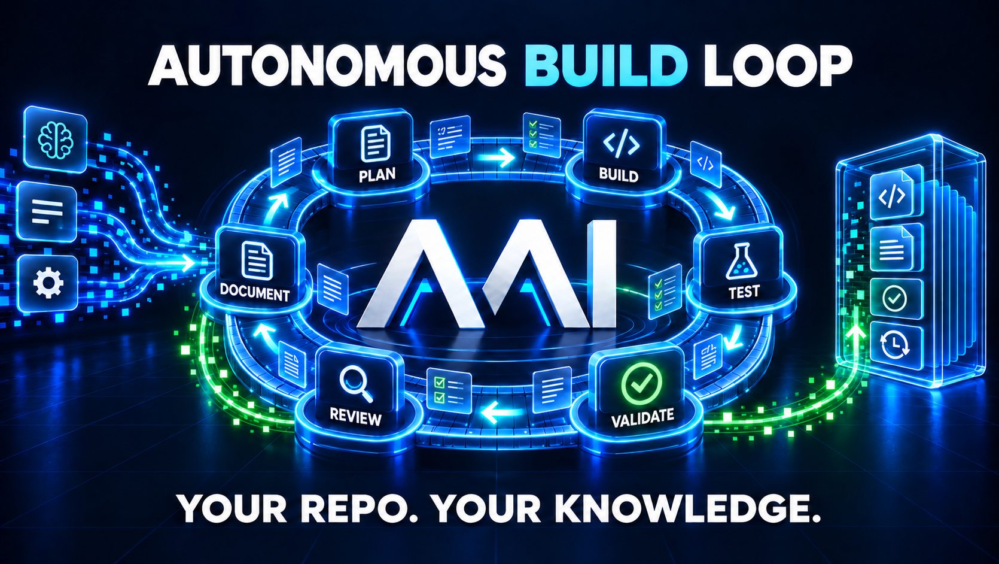

# AAI — build with AI. Keep the knowledge.

**Choose your AI provider, agent harness, and model. Keep one autonomous build loop and your project's knowledge in your repository.**



AAI adds a repeatable development loop to an existing repository. It turns a need into a spec with acceptance criteria, implementation and tests, an independent validation pass, code review, documentation, and a pull request. The agent can prepare the change; **you control the merge**.

The work also leaves something useful behind: product documentation for user-visible capabilities, decisions, project knowledge, lessons learned, and an audit trail. AAI's [docs index](docs/INDEX.md) shows which tracked work is draft, active, or done, while the docs audit checks whether completion claims have evidence. Your next agent can pick up where the last one stopped.

**From request to PR:** plan → build → test → validate independently → review → document → ship.

## Try it in your project

From the root of your project, install AAI in a terminal:

```bash
curl -fsSL https://raw.githubusercontent.com/goodwind-cz/aai/main/install.sh | bash
```

On Windows PowerShell, use `irm https://raw.githubusercontent.com/goodwind-cz/aai/main/install.ps1 | iex` instead. Review the files it added with `git status` and `git diff`.

In your AI coding agent's chat, run `/aai-bootstrap` once to adapt AAI's test, build, and lint shortcuts to your project. Then use these **agent commands** (not shell commands):

### Shape the request with `/aai-intake`

```text
/aai-intake "Add password reset via email"
```

AAI saves a draft request in your repository and prints its path. Review or refine that draft before building.

### Build the draft with `/aai-ship`

```text
/aai-ship docs/requirements/PRD-DRAFT-password-reset-via-email.md
```

Use the path returned by `/aai-intake`; the one above is an example. `/aai-ship` continues from that draft through planning, implementation, independent validation, review, product docs for user-visible work, and the pull request. It can also accept a one-sentence request and create the intake itself. You review and merge the result. For manual control of each stage, use `/aai-loop` and `/aai-pr` after intake. See the [User Guide](docs/USER_GUIDE.md) if your agent does not expose the slash commands directly.

### Keep AAI up to date

In a project where AAI is installed, ask your agent to preview and then apply an update:

```text
/aai-update --dry-run
/aai-update
```

The update refreshes the vendored AAI layer from the canonical repository, reports changed files and any conflicts, and leaves the commit to you. Review the result with `git diff` in your terminal. See the [update guide](docs/product/aai-update.md) for options and limits.

## Why use AAI?

- **Freedom to change tools.** AAI's repository-local skills are available in Claude Code, Codex, Cursor, and Google's Antigravity (IDE/CLI). Choose the provider and model your agent offers; the workflow and project knowledge stay with your code. Gemini CLI remains supported for eligible enterprise, Cloud, and paid-API users, but Antigravity CLI is the current path for Google's free and AI Pro/Ultra plans. Model routing varies by harness—Cursor uses your selected model, and Antigravity has shared skill discovery but no dedicated AAI model route yet. See the [harness notes](docs/USER_GUIDE.md#agent-harnesses-and-models).
- **Evidence before “done.”** Acceptance criteria are tied to tests and evidence. Validation runs in a fresh context and uses a different model when the harness makes one available; a separate review checks the change against the spec. Failed checks send the work back for remediation.
- **Know what is draft and what shipped.** The [docs index](docs/INDEX.md) groups tracked requests and specs by status; `/aai-docs-audit` checks for stale or unsupported completion claims. Acceptance criteria, decisions, and audit events show what changed and why.
- **A repository that remembers.** Specs, tests, decisions, product docs, reusable patterns, lessons learned, and shared audit events live beside your code. AAI can surface relevant past learning before new work; its end-to-end ship flow creates or updates product docs for user-visible capabilities.

AAI is a vendored layer of Markdown prompts and small Node/shell tools; it needs no hosted project space. Temporary runtime state and validation reports stay local, while durable conclusions go into tracked project docs.

For the phase and gate contract, see [how the loop works](.aai/workflow/WORKFLOW.md).

<details>
<summary>Advanced installation and manual sync</summary>

## More installation options

The quick-start installers download the canonical AAI repository and sync its workflow files into your current project. To inspect a script before running it, use one of these review-first variants.

PowerShell:

```powershell
irm https://raw.githubusercontent.com/goodwind-cz/aai/main/install.ps1 -OutFile install-aai.ps1
Get-Content .\install-aai.ps1
powershell -ExecutionPolicy Bypass -File .\install-aai.ps1
```

Bash:

```bash
curl -fsSLo install-aai.sh https://raw.githubusercontent.com/goodwind-cz/aai/main/install.sh
less install-aai.sh
bash install-aai.sh
```

Optional environment overrides for the one-liner:

PowerShell:

```powershell
$env:AAI_REF = "main"
$env:AAI_TARGET_ROOT = "C:\path\to\your-project"
irm https://raw.githubusercontent.com/goodwind-cz/aai/main/install.ps1 | iex
Remove-Item Env:\AAI_REF, Env:\AAI_TARGET_ROOT -ErrorAction SilentlyContinue
```

Bash:

```bash
curl -fsSL https://raw.githubusercontent.com/goodwind-cz/aai/main/install.sh |
  AAI_REF=main AAI_TARGET_ROOT=/path/to/your-project bash
```

Or run the installer after cloning/downloading this repository:

PowerShell:

```powershell
powershell -ExecutionPolicy Bypass -File .\install.ps1 -TargetRoot C:\path\to\your-project
```

Bash:

```bash
bash ./install.sh --target-root /path/to/your-project
```

After install, review the changes in your terminal:

```bash
git status
git diff
```

Then ask your coding agent to run `/aai-bootstrap` and `/aai-doctor` in its chat.

## Sync AAI into another repository

Run the sync script **from this repository** and pass the path to the target project.
The script resolves its own source root automatically — no need to copy it to the target first.

### Bash / Git-Bash
```bash
# From this aai repo:
./.aai/scripts/aai-sync.sh ../your-project

# Then in the target project:
cd ../your-project
git status
git diff
git add .aai docs CLAUDE.md CODEX.md GEMINI.md README_AAI.md SKILLS.md .github/copilot-instructions.md .gitignore
git commit -m "Update AAI layer"
```

### PowerShell
```powershell
# From this aai repo:
.\.aai\scripts\aai-sync.ps1 -TargetRoot ..\your-project

# Then in the target project:
cd ..\your-project
git status
git diff
git add .aai docs CLAUDE.md CODEX.md GEMINI.md README_AAI.md SKILLS.md .github/copilot-instructions.md .gitignore
git commit -m "Update AAI layer"
```

- Sync scope includes `.aai/**`, `.claude/skills/**`, `.codex/skills/**`, `.gemini/skills/**`, `.agents/skills/**`, `.cursor/rules/aai.mdc`, `.github/copilot-instructions.md`, `docs/knowledge`, and root shims (`CLAUDE.md`, `CODEX.md`, `GEMINI.md`, `README_AAI.md`, `SKILLS.md`).
- Session-start hooks are synced under `hooks/`, including `hooks/session-start.sh` for POSIX shells and `hooks/session-start.ps1` plus `hooks/hooks.windows.json` for native Windows PowerShell registration.
- For `.claude/skills/**`, template entries are updated, while target-only local skills are preserved.
- Target `.gitignore` is auto-updated to ignore `.claude/skills/`, `.codex/skills/`, `.codex/skills.local/`, `.gemini/skills/`, `.gemini/skills.local/`, and `.agents/skills/` (sync-managed artifacts).
- `.github/copilot-instructions.md` is auto-merged: project-specific content is preserved in `docs/ai/project-overrides/copilot-instructions.project.md` and appended under a dedicated Project Overrides section.
- If other local target content is overwritten, sync creates a local-only advisory in `docs/ai/reports/sync-conflicts-*.md`.
- Reports under `docs/ai/reports/` are runtime artifacts and should not be committed; durable conclusions must be promoted into project-owned docs.
- Dynamic project skills should use unique `aai-*` names under `.claude/skills/` so they stay target-only and preserved on sync.
- Runtime files in target `docs/ai` are preserved (not overwritten) if they already exist: `STATE.yaml`, `METRICS.jsonl`, `LOOP_TICKS.jsonl`, `EVENTS.jsonl`, `decisions.jsonl`.
- `docs/ai/STATE.yaml` and `docs/ai/LOOP_TICKS.jsonl` are auto-added to the target `.gitignore` (RFC-0001: per-developer local). Run `bash .aai/scripts/migrate-state-to-local.sh` in the target project to untrack any previously committed copy.
- Missing `docs/TECHNOLOGY.md` is seeded from `.aai/templates/TECHNOLOGY_TEMPLATE.md` and then becomes project-owned.
- It intentionally does **not** overwrite project docs under `docs/requirements`, `docs/specs`, `docs/decisions`, `docs/releases`, `docs/issues`, `docs/rfc`, or `docs/project-sessions`.

</details>

## Orientation

### The loop

Every scope moves through six phases, defined canonically in
[.aai/workflow/WORKFLOW.md](.aai/workflow/WORKFLOW.md):
**Planning → Implementation preparation → Implementation → Validation → Code Review → Remediation**.
Implementation preparation is the worktree gate — when Planning recommends
isolation, the agent asks you before creating a worktree (or accepts an
explicit inline override). Validation runs in a fresh context and uses a
different model when available. Code Review is a separate adversarial pass;
a FAIL from either routes the scope into Remediation and back through
independent re-validation. A finished scope ends with `/aai-pr` opening a
pull request. Merging is your action unless you have recorded explicit
standing authorization for a defined scope.

### Repository map

```
.aai/                       AAI system: canonical prompts (intake, roles, skills,
                            reverse analysis), scripts/, workflow/WORKFLOW.md,
                            templates/, system/ docs, knowledge/ (universal patterns)
.claude/ .codex/ .gemini/   Per-agent skill wrappers (sync-managed)
.agents/skills/             Shared project skills for Cursor and Antigravity
.cursor/rules/              Cursor project rule pointing to AAI guidance
hooks/                      Session-start hooks (POSIX, PowerShell, Windows registration)
tests/                      Skill tests (tests/skills/), self-hosting smoke tests,
                            disposable sync fixture (tests/fixtures/target-project/)
docs/requirements|specs|rfc|issues|releases   Tracked work documents (intake output)
docs/knowledge/             Project facts, patterns, UI map, LEARNED.md
docs/roles|templates|workflow                 Project-doc mount points (seeded per project)
docs/ai/                    Runtime layer: state, append-only logs, reports, reviews
CHANGELOG.md                Release-facing change history
install.sh / install.ps1    One-line installer entrypoints
```

### Runtime state and append-only logs

`docs/ai/STATE.yaml` is the runtime state file — written transactionally by the
loop via `.aai/scripts/state.mjs`, never hand-edited, per-developer local and
gitignored (RFC-0001). The JSONL logs are append-only (one JSON object per
line, never rewritten):

- `docs/ai/LOOP_TICKS.jsonl` — external timing per loop tick, written by the loop runner scripts. Per-developer local (gitignored).
- `docs/ai/EVENTS.jsonl` — audit log of AC status transitions and doc lifecycle changes, appended via `.aai/scripts/append-event.mjs`. Shared, committed.
- `docs/ai/METRICS.jsonl` — completed work-item economics, flushed by `.aai/METRICS_FLUSH.prompt.md`. Shared, committed.
- `docs/ai/decisions.jsonl` — human-in-the-loop decisions, written by `.aai/SKILL_HITL.prompt.md`. Shared, committed.

### Intake language policy

- You can provide intake answers in your preferred language; the assistant asks follow-ups in that language.
- Saved repository documents are always written in English.
- Intake stays token-light: only high-impact missing fields are asked; minor gaps proceed as explicit assumptions.

Minimal input examples (Czech input is fine; the saved doc stays English):

- Change: "V detailu objednavky chci zobrazit i interni kod skladu, kvuli podpore."
- Issue: "Pri prihlaseni pres SSO obcas spadne callback s 500; reprodukce na stagingu."
- Feature (PRD): "Chci export faktur do CSV kvuli auditu. AC: export do 5s pro 10k radku."
- RFC: "Potrebujeme rozhodnout mezi RabbitMQ a SQS pro asynchronni processing."
- Release: "Release 1.12.0 pristi stredu, scope PRD-014 + SPEC-022, gate: pytest -q."

## Where everything else lives

- [docs/USER_GUIDE.md](docs/USER_GUIDE.md) — the manual: the full skills catalog, step-by-step workflows, loop runner reference, self-hosting contract, troubleshooting and FAQ.
- [.aai/AGENTS.md](.aai/AGENTS.md) — agent-side entry point and the authoritative list of canonical prompts and sources.
- [.aai/workflow/WORKFLOW.md](.aai/workflow/WORKFLOW.md) — the only authoritative workflow definition (phases, gates, stop conditions).
- [.aai/PLAYBOOK.md](.aai/PLAYBOOK.md) — the human operating playbook.
- [docs/TECHNOLOGY.md](docs/TECHNOLOGY.md) — the authoritative technology contract.
- [docs/knowledge/LEARNED.md](docs/knowledge/LEARNED.md) — project-specific learned rules.
- [CHANGELOG.md](CHANGELOG.md) — what changed, release by release.
- [docs/INDEX.md](docs/INDEX.md) — auto-generated catalog of all tracked docs (status, progress, refs).

## License

MIT — see [LICENSE](LICENSE). Copyright (c) 2026 Aleš Holubec.

AAI is meant to be vendored: `install.sh` copies its files into your repository, and MIT is the licence that makes that copying unambiguous. Keep the copyright notice with the copied files and you are done.
